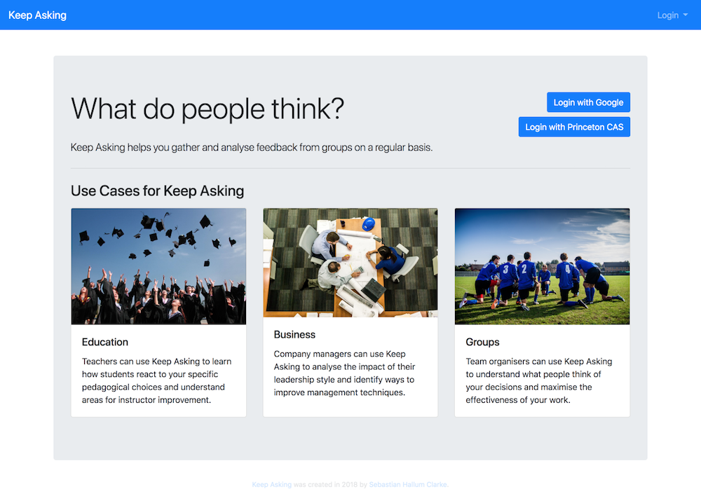
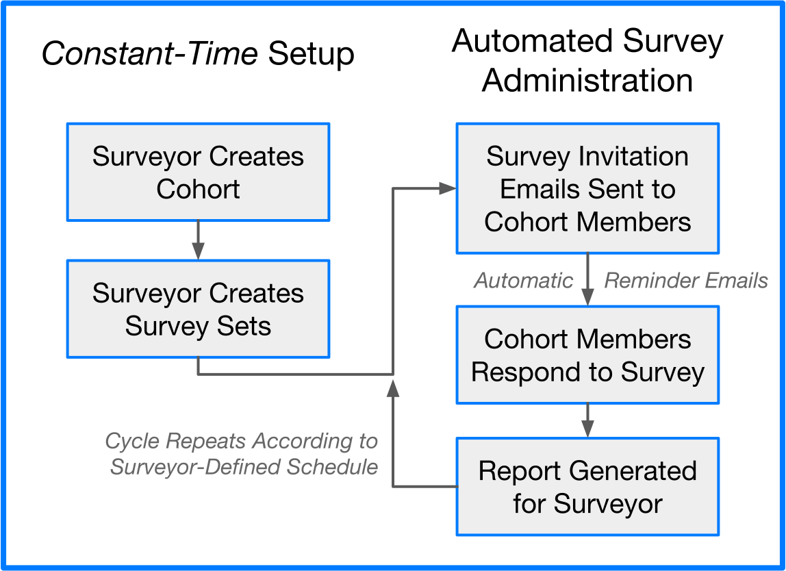

# Keep Asking
Keep Asking is a web system for administering recurring surveys developed by [Sebastian Hallum Clarke](https://www.sebthedev.com) as an Independent Work project at Princeton University's Department of Computer Science. This project was advised by Professor Jérémie Lumbroso ([jlumbroso](https://github.com/jlumbroso), lumbroso@cs.princeton.edu).

You can experience Keep Asking at [keepasking.io](https://www.keepasking.io) or build your own instance from source.



## System Overview
Keep Asking makes it easy to design, manage, and analyse the results of recurring feedback surveys. The workflow of the system is depicted in the flowchart below.



## Installation Instructions
To build your own instance of Keep Asking:
1. Download the source code and `cd` into the `keep-asking` directory:
```bash
git clone https://github.com/sebthedev/keep-asking.git
```
2. Install [Node.js](https://nodejs.org/en/) if you do not already have it installed. (You can check if Node is installed by running `node --v` at your command prompt)
3. Run `npm install` to load dependencies.
4. Set environment variables either in your shell or in a file named `.env` in the root of the `keep-asking` directory. You must define the variables `MONGODB_URI` (a fully-formed MongoDB database URI) and `HASH_SECRET` (an arbitrary string that will be used to secure links sent in emails).
5. Run `npm start` to launch!
